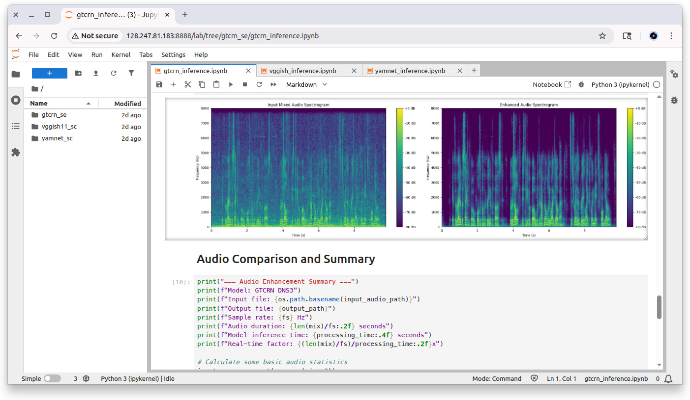

# AudioAI-ModelZoo

A collection of optimized Deep Neural Network (DNN) models for Audio Tasks on TI EdgeAI processors. Models are converted from PyTorch and TensorFlow into embedded-friendly formats optimized for TI SoCs.


**Notice**: The models in this repository are being made available for experimentation and development - they are not meant for deployment in production.

## System Requirements

- **Processors**: AM62A (extensible to TDA4VM, AM67A, AM68A, AM69A)
- **TIDL Version**: 11_02_02_00

## Quick Start

### Git pull the project

On the Linux command line on the target (AM62A)

```bash
mkdir ~/tidl && cd ~/tidl
git clone https://github.com/TexasInstruments-Sandbox/audioai-modelzoo.git
cd audioai-modelzoo
```

### Download Models and Model Artifacts

```bash
./download_models.sh -y
./download_artifacts.sh -y
```

Both scripts provide interactive menus to select and download models.

### Docker Image Setup

This repository uses a two-stage Docker build process (see [docker](docker) folder). The base image contains all dependencies and is pre-built and available from GitHub Container Registry. The TI-specific image adds processor-specific libraries on top of the base.

Pull the pre-built base image and build the TI image:

```bash
docker pull ghcr.io/texasinstruments-sandbox/audioai-base:11.2.0
docker tag ghcr.io/texasinstruments-sandbox/audioai-base:11.2.0 audioai-base:11.2.0
cd docker
./docker_build_ti.sh
```

If you want to build the base image from scratch instead of pulling it, run `./docker_build_base.sh` before building the TI image.

## Start Jupyter Server

Launch the Docker container:

```bash
/root/tidl/audioai-modelzoo/docker/docker_run.sh
```

Inside the Docker container, start Jupyter Lab:

```bash
cd ~/tidl/audioai-modelzoo/inference
jupyter-lab --ip=$TARGET_IP --no-browser --allow-root
```

Access Jupyter Lab from your browser using the URL displayed in the terminal.



## Pre-Trained Models

Models are located in the **[models](models)** folder.

### Speech Enhancement (Audio-to-Audio)

#### GTCRN

_**Inference in Jupyter Notebook**_: [inference/gtcrn_se/gtcrn_inference.ipynb](inference/gtcrn_se/gtcrn_inference.ipynb)

### Sound Classification (Audio-to-Class)

#### VGGish11

_**Inference in Jupyter Notebook**_: [inference/vggish11_sc/vggish_inference.ipynb](inference/vggish11_sc/vggish_inference.ipynb)


Python script version: Below should be run inside the Docker container.

```bash
python3 vggish_infer_audio.py --audio-file sample_wav/139951-9-0-9.wav --detailed-report
```

#### YAMNet

_**Inference in Jupyter Notebook**_: [inference/yamnet_sc/yamnet_inference.ipynb](inference/yamnet_sc/yamnet_inference.ipynb)

Python script version: Below should be run inside the Docker container.

```bash
python3 yamnet_infer_audio.py --audio-file samples/miaow_16k.wav --detailed-report
```

## Performance Benchmarks

|      Model      | Input Audio (sec) | Inference Time (ms) | Real-Time Factor |
|:---------------:|:-----------------:|:-------------------:|:----------------:|
|  GTCRN (FP32)   |       9.77        |       679.90        |      0.070       |
| VGGish11 (INT8) |       4.00        |        91.10        |      0.023       |
|  YAMNet (INT8)  | 6.73 (7 patches)  |     17.53 total     |      0.003       |

*Note: Real-Time Factor (RTF) = Processing Time / Audio Duration. RTF < 1.0 means faster than real-time. Performance metrics may vary depending on system conditions.*

## Model References

- **GTCRN**: https://github.com/Xiaobin-Rong/gtcrn
- **VGGish**: https://github.com/tensorflow/models/tree/master/research/audioset/vggish
- **YAMNet**: https://github.com/tensorflow/models/tree/master/research/audioset/yamnet, https://github.com/w-hc/torch_audioset

