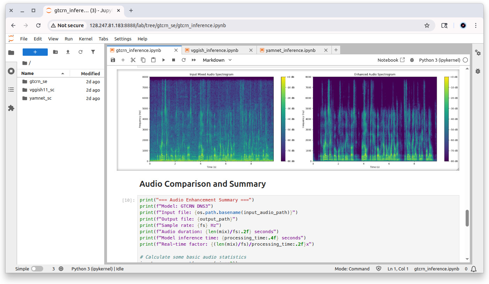

# AudioAI-ModelZoo

A collection of optimized Deep Neural Network (DNN) models for Audio Tasks on TI EdgeAI processors. Models are converted from PyTorch and TensorFlow into embedded-friendly formats optimized for TI SoCs.

**Notice**: The models in this repository are being made available for experimentation and development - they are not meant for deployment in production.

## System Requirements

- **Processor**: AM62A
- **SDK Version**: AM62A 11.1
- **TIDL Version**: 11_01_06_00

## Quick Start

### Git pull the project

On the Linux command line on the target (AM62A)

```bash
mkdir -p ~/tidl && cd ~/tidl
git clone https://github.com/TexasInstruments/audioai-modelzoo.git
cd audioai-modelzoo
```

### Setup (Python venv)

The notebooks run directly on the target rootfs in a Python virtual environment. This reuses the TIDL-enabled `onnxruntime` and `tflite_runtime` already present in the Processor SDK rootfs.

```bash
./download_models.sh -y
./download_artifacts.sh -y
./setup_venv.sh      # creates ~/venv/modelzoo with --system-site-packages
```

The download scripts provide interactive menus (omit `-y`). The setup script checks for the TIDL `onnxruntime` in the system site-packages and verifies `TIDLExecutionProvider` is available before finishing.

Activate the venv in each new shell before running the scripts below:

```bash
source ~/venv/modelzoo/bin/activate
```

### Start Jupyter Lab

```bash
cd ~/tidl/audioai-modelzoo
./jupyter_lab_venv.sh
```

The script displays a highlighted access URL (token: `tidl`) and pre-loads the three inference notebooks in tabs.



### Alternative: Docker

A Docker-based setup is also available. See [docs/docker.md](docs/docker.md).

## Pre-Trained Models

Models are located in the models folder.

### Speech Enhancement (Audio-to-Audio)

#### GTCRN

_**Inference in Jupyter Notebook**_: [inference/gtcrn_se/gtcrn_inference.ipynb](inference/gtcrn_se/gtcrn_inference.ipynb)

### Sound Classification (Audio-to-Class)

#### VGGish11

_**Inference in Jupyter Notebook**_: [inference/vggish11_sc/vggish_inference.ipynb](inference/vggish11_sc/vggish_inference.ipynb)

Python script version (run in the activated venv):

```bash
cd ~/tidl/audioai-modelzoo/inference/vggish11_sc
python3 vggish_infer_audio.py --audio-file sample_wav/139951-9-0-9.wav
```

#### YAMNet

_**Inference in Jupyter Notebook**_: [inference/yamnet_sc/yamnet_inference.ipynb](inference/yamnet_sc/yamnet_inference.ipynb)

Python script version (run in the activated venv):

```bash
cd ~/tidl/audioai-modelzoo/inference/yamnet_sc
python3 yamnet_infer_audio.py --audio-file samples/miaow_16k.wav
```

## Performance Benchmarks

|      Model      | Input Audio (sec) | Inference Time (ms) | Real-Time Factor |
| :-------------: | :---------------: | :-----------------: | :--------------: |
|  GTCRN (FP32)   |       9.77        |       679.90        |      0.070       |
| VGGish11 (INT8) |       4.00        |        8.88         |      0.002       |
|  YAMNet (INT8)  | 6.73 (7 patches)  |     17.53 total     |      0.003       |

_Note: Real-Time Factor (RTF) = Processing Time / Audio Duration. RTF < 1.0 means faster than real-time. Performance metrics may vary depending on system conditions._

## Model References

- **GTCRN**: https://github.com/Xiaobin-Rong/gtcrn
- **VGGish**: https://github.com/tensorflow/models/tree/master/research/audioset/vggish
- **YAMNet**: https://github.com/tensorflow/models/tree/master/research/audioset/yamnet, https://github.com/w-hc/torch_audioset

## Questions & Feedback

If you have any questions or feedback, please visit [TI E2E](https://e2e.ti.com/support/processors-group/processors/f/processors-forum).
